# 2D 生图 → 游戏可用 2D 资产 + 骨骼动画：工业化 workflow（spec/2d-asset-skeletal-workflow.md）

> 日期：2026-08-13 ｜ 依据：`生图.md`（网易 DreamMaker 全链路调研）+ 外部工业化实现调研（2025-2026）
> 核心判断：**生图→2D 资产（拆层/抠图）已 AI 化成熟；2D 骨骼绑骨进入"半自动"（UniRig/Spine-Anim-AI/StretchyStudio/Spiritus 等，5-10min vs 手工 1-2h）；动画=关键帧+程序化 runtime，AI 动作补全可用**。

## 0. 结论速览（对照生图.md）
| 环节 | DreamMaker（生图.md） | 外部工业化（2025-2026） | 结论 |
|---|---|---|---|
| 生图 | ✅ GPT-Image/纳米香蕉/SD+ControlNet | VNCCS 3.0 / mor-o 2d-character-pipeline | 完全成熟 |
| 拆层/抠图 | ✅ CHORD 分解+超分（2D 资产近全覆盖 180s） | See-through / VTuber2D.AI / SAM2+PS / img2rig | AI 化成熟 |
| 2D 绑骨 | ❌ 无 AI 自动绑骨（编辑器手工为主） | **UniRig / Spine-Anim-AI / StretchyStudio / Spiritus / ASMR / Adobe HtYD** | 半自动可用 |
| 动画 | ⚠️ 3D 动作补全已落地；2D 动画编辑器为主 | Spine runtime / Live2D 参数 / Motion Completion / SCAIL2 / PoseCap | 骨骼动画成熟，AI 动作辅助 |
| 打包/引擎 | ✅ Cutlas 图集 / SpineComponent | Spine atlas / TexturePacker / Godot/Unity/UE | 成熟 |

## 1. 全链路 workflow 图（mermaid）

```mermaid
flowchart LR
    subgraph S0["0 生图（资产源头）"]
        A1["文生图 / 参考图生图<br/>GPT-Image-2 / Nano Banana / SD+LoRA+ControlNet<br/>IP-Adapter / 风格LoRA"]
        A2["专业管线<br/>VNCCS 3.0（角色/服装/表情/姿态）<br/>mor-o 2d-character-pipeline"]
    end
    subgraph S1["1 拆层 / 抠图（整图→可动部件）"]
        B1["See-through（单图→2.5D分层+深度）"]
        B2["VTuber2D.AI / SAM2+PS（头发/身体/眼睛/衣服→PSD）"]
        B3["img2rig（LLM+SAM→分层rig）"]
        B4["mor-o cosmetic layers（像素对齐精灵层）"]
    end
    subgraph S2["2 骨骼绑定（半自动 rigging）"]
        C1["编辑器：Spine（网格/权重/Skins）<br/>Live2D Cubism（参数化）<br/>DragonBones（开源）"]
        C2["AI 自动绑骨：UniRig / Spine-Anim-AI<br/>StretchyStudio / Spiritus / ASMR / Adobe HtYD"]
    end
    subgraph S3["3 动画（骨骼/序列帧）"]
        D1["骨骼动画：Spine runtime API / Live2D 参数"]
        D2["AI 动作：Motion Completion（补中间帧）<br/>SCAIL2（视频动作迁移）/ PoseCap（视频动捕）"]
        D3["序列帧：2dimg2motion（key-pose→in-between→精灵表）"]
    end
    subgraph S4["4 打包 / 引擎"]
        E1["图集：Cutlas / Spine atlas / TexturePacker"]
        E2["引擎导入：Godot / Unity / UE"]
        E3["运行时：SpineComponent / Live2D SDK / Godot AnimationTree"]
    end
    S0 --> S1 --> S2 --> S3 --> S4
```

## 2. 各环节工业化实现
### 0 生图
- 云 API：GPT-Image-2（**多图引用**，本项目已实测可用）、Nano Banana Pro/2
- 本地/开源：SD + 风格 LoRA（锁画风）+ ControlNet（结构控制）、InstantID/IP-Adapter（锁角色）
- 专业管线：**VNCCS 3.0**（端到端角色生产：Character/Clothes/Emotion/Pose Studio，sprite 按 costume+emotion 组织）、**mor-o 2d-character-pipeline**（基础动画精灵表 + cosmetic 分层，运行时 tint）

### 1 拆层（关键：整图 → 可动部件）
- **See-through**（ComfyUI 插件）：单张动漫立绘 → 2.5D 分层模型（带深度排序），直接给 Live2D
- **VTuber2D.AI**：单张立绘 → ComfyUI 自动分离 头发/身体/眼睛/衣服 → 可编辑 PSD → Live2D rigging
- **SAM2 + PS 2026**：万物分割 + PS 生成式补图 → 单图变"骨骼级全资产源文件"
- **img2rig**：LLM agent + SD + GroundingDINO + SAM → 分层 rig（替代 rigger + cleanup）
- **AIGC+PS+Spine**：AI 底图 → 智能抠图 + 遮挡修复 → 官方脚本自动骨骼绑定
- 产出契约：**Live2D 规范 PSD**（头发/表情眉眼口/手/衣服分层；无蒙版，遮罩分离成单独图层；左右眼/双眼皮分层；图层命名规范）

### 2 骨骼绑定
- 工业编辑器：**Spine**（网格+权重+Skins 变体）、**Live2D Cubism**（参数系统≈blend shape，无需蒙版）、**DragonBones**（开源，支持 Live2D 转换）
- **AI 自动绑骨（2025-2026 突破）**：
  - **UniRig**（ComfyUI）：自动骨骼绑定，简单角色 5-10min（手工 1-2h）
  - **Spine Animation AI**（Claude skill）：SIFT+RANSAC 定位部件 → 骨骼 JSON → 动画
  - **Stretchy Studio**（FOSS）：DWPose 姿态检测自动生成骨骼
  - **Spiritus**（ACM 2025）：~30s 完成"分层生成+自动骨骼"并直接导入 Unity
  - **ASMR**（2025）/**Adobe How-to-Train-Your-Dragon**（2025）：扩散模型自动绑骨蒙皮

### 3 动画
- 骨骼动画：Spine runtime（程序化控制/动画混合/Skins）、Live2D 参数（表情/口型）
- AI 动作：**Motion Completion**（in-betweening/动作补全，网易生产落地）、**SCAIL2**（ComfyUI 视频动作迁移）、**PoseCap**（视频→Bip/fbx 标准动画）
- 序列帧替代方案：**2dimg2motion**（identity lock → key-pose sheet → in-betweens → 去背景 → 精灵表打包）

### 4 打包/引擎
- 图集：Cutlas（UI 图集自动化）、Spine atlas、TexturePacker
- 引擎：Godot（本项目）/ Unity / UE；运行时 SpineComponent / Live2D SDK / Godot AnimationTree

## 3. 对本项目（角色AIGC全链路）的落地映射
| 环节 | 本项目现状 | 目标方案 |
|---|---|---|
| 生图 | ✅ GPT-Image-2 + 多参考（已验证）；画风待定 | + Nano Banana；画风锁死 → ComfyUI + 风格 LoRA |
| 拆层 | ❌ 未做（整图 + 表情合成） | See-through / VTuber2D.AI 拆层 → Live2D 规范 PSD |
| 骨骼 | ❌ | Spine / Live2D + UniRig / Spine-Anim-AI 自动绑骨 |
| 动画 | ⚠️ 像素序列帧 t9 已过；Q版 chibi v2 已出 | Spine runtime 或序列帧（2dimg2motion） |
| 打包/引擎 | ✅ Godot 导入 PNG/WAV 已验 | + Spine atlas / 图集导入 |

## 4. 下一步建议（进入开发前定）
1. **画风**：从 style_attempts/compare_sheet 选定主画风 → ComfyUI + 风格 LoRA（spec/comfyui-lora-plan.md）
2. **拆层**：引入 See-through / VTuber2D.AI 工作流，把立绘拆成 Live2D 规范 PSD（P6 DCC 加工的前置）
3. **骨骼**：Q 版小人/立绘 → Spine（或 Live2D）+ 自动绑骨（UniRig / Spine-Anim-AI）
4. **动画**：Spine runtime 动画 或 序列帧（2dimg2motion）；AI 动作补全（Motion Completion/SCAIL2）可选
5. **引擎**：Godot 导入 Spine atlas / 序列帧 → 可交互 NPC（P4）
