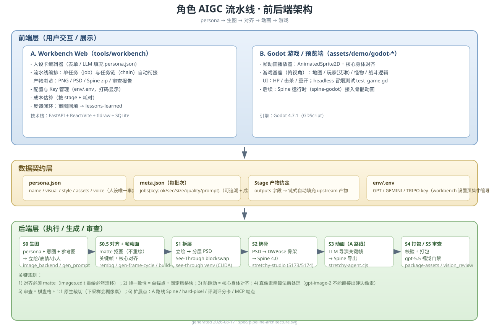

# 角色 AIGC 流水线 · 前后端设计（spec/pipeline-architecture.md）

> 整理日期：2026-08-17 ｜ 目标：把"生图 → 对齐 → 姿势 → 动画 → 游戏"全链路的前后端结构、数据契约、扩展点写清楚，供工作台/游戏端统一演进。

## 1. 总览（前后端分层）

```
┌───────────────────────── 前端层 ─────────────────────────┐
│  A. Workbench Web（tools/workbench）                      │
│     人设卡编辑/LLM填充 · 任务编排(S0-S5) · 产物浏览 ·      │
│     Key/配置管理 · 成本估算 · lessons 反馈闭环             │
│  B. Godot 游戏/预览端（assets/demo/godot-*）              │
│     帧动画播放 · 地图 · 战斗逻辑 · 骨骼动画(Spine 后续)    │
└──────────────┬───────────────────────────────────────────┘
               │ HTTP / 文件系统（artifacts）
┌──────────────▼───────────────────────────────────────────┐
│  后端层（tools/ + pipeline/）                             │
│  S0 生图       image_backend(openai/gemini/fal) + gen_*   │
│  S0.5 对齐/帧  rembg matte + gen-frame-cycle +            │
│                build-godot-anim-demo（今日新增）          │
│  S1 拆层       see-through LayerDiff3D → PSD              │
│  S2 绑骨       StretchyStudio DWPose → Spine              │
│  S3 动画       stretchy-agent(LLM导演)                    │
│  S4 打包/引擎  package-assets / validate-*                │
│  S5 审查       vision_review(gpt-5.5) 质量门禁            │
└──────────────────────────────────────────────────────────┘
```

## 2. 前端设计

### 2.1 Workbench Web（tools/workbench，FastAPI + React/Vite + tldraw）
| 模块 | 职责 |
|---|---|
| 人设卡编辑器（PersonaForm） | 表单 → persona.json；LLM 填充角色设定 |
| 流水线编排（Stages/Chains） | S0-S5 单任务执行 / 多任务链自动衔接（upstream 产物自动填充） |
| 产物浏览（Artifacts） | 按 job 展示 PNG/PSD/Spine zip/审查报告 |
| 配置管理（/api/config） | env/.env 读写（GPT/GEMINI/TRIPO key，打码显示） |
| 成本估算（estimate_cost） | 按 stage + 耗时估算 API 成本 |
| 反馈闭环（Lessons） | 审图回填 → lessons-learned → 生成下一轮 prompt 约束 |

### 2.2 Godot 游戏/预览端
- 帧动画播放器：AnimatedSprite2D + 核心身体对齐（build-godot-anim-demo.py 产物）
- **游戏基座（2026-08-17 四次迭代：改为 2D 横板平台游戏）**：`assets/demo/godot-game-base/`
  - 地图：**Tiny RPG - Forest**（ansimuz，公有领域）官方 60×45 地图移植；组合图集 = tileset.png(1088) + objects.png(360) 拼接（1448 瓦片，索引连续）；双层 TileMap（地面层 + 树冠/装饰覆盖层 y-sort）+ 行合并碰撞体（868 格）
  - **渲染修复（关键）**：必须显式设置 `TileSet.tile_size = 64`（默认 16 与 64px 瓦片不符 → 瓦片按 16px 间距平铺在原点附近，摄像机视野内全是空白背景色 → "全黑灰无地图"）
  - 摄像机：Camera2D 跟随玩家 + 平滑 + 地图边界限制
  - 玩家：**默认 Tiny RPG Forest 包内 4 向弓箭手英雄**（32x32 原生像素，scale 4=128px，与地图风格一致、零尺寸漂移）；3 键切回英雄，1/2 键切换艾琳 HD-2D/像素（对齐帧 1:1 + NEAREST）
  - 攻击：body_entered + 攻击窗口重叠轮询（覆盖贴身情况）
  - 史莱姆怪物：巡逻→追击→接触伤害；受击/死亡/重生
  - UI：HP 条/击杀数/重开(R)；启动 start-game.cmd
  - 验证：headless 冒烟测试 ALL PASS（含攻击命中断言）+ GUI 截图确认地图渲染（vision 审核通过）
  - 工具：tools/port-tiny-rpg-map.py；预览图 assets/maps/forest-preview.png
- 后续：Spine 运行时（spine-godot）接入骨骼动画（A 路线）

## 3. 后端设计（按 Stage）

| Stage | 输入 | 处理 | 输出 | 关键工具 |
|---|---|---|---|---|
| S0 生图 | persona.json + 意图/视图/表情 + 参考图 | prompt 模板（gen_prompt.py）→ 中转站 gpt-image-2 | full/bust/exp_*/chibi_* | image_backend.py, gen_prompt.py |
| **S0.5 对齐+帧动画（新）** | 原图(场景) / matte hero | ① rembg 抠图+条件 defringe（像素级对齐）② gen-frame-cycle 单锚点关键帧 ③ 核心身体对齐 + Godot 构建 | hero_*_final.png / frames_* / godot-*-anim/ | rembg, gen-frame-cycle.py, build-godot-anim-demo.py |
| S1 拆层 | 立绘 PNG | See-through LayerDiff3D blockswap(8GB) → 分层 PSD | layered/*.png + *.psd + depth | see-through venv (CUDA) |
| S2 绑骨 | 分层 PSD | StretchyStudio DWPose 自动绑骨 | *.stretch + *_spine.zip + gate_rig.txt | stretchy-studio (5173/5174) |
| S3 动画 | .stretch | LLM 导演（DeepSeek）关键帧动画 | 4 clip + Parameters + spine.zip | stretchy-agent.cjs |
| S4 打包 | 动画/资产 | 校验 + 打包 | asset package / 引擎清单 | package-assets.py, validate-*.py |
| S5 审查 | 任意产物 | gpt-5.5 视觉审查（棋盘格/拼图/1:1裁切） | 审查报告 → lessons | vision_review.py |

## 4. 数据契约（跨端）
| 契约 | 字段 | 用途 |
|---|---|---|
| persona.json | name/race/class/visual/style/assets/voice | 人设→prompt 的唯一事实源 |
| meta.json（每批次） | jobs{key:{ok,sec,size,quality,prompt}} | 批次可追溯、成本核算 |
| stage 产物约定 | outputs 字段（见 workbench STAGES） | 链式自动填充 upstream |
| env/.env | GPT_API_KEY/BASE_URL/TRIPO/… | Key 集中管理（workbench 设置页） |

## 5. 今日新增链路（已固化，见 frame-anim-workflow.md）
- 对齐 hero：**matte 不重绘**（rembg + 条件 defringe）→ 像素级=原图去背景
- 帧一致性：单锚点 + 固定风格块（gen-frame-cycle.py）
- 防跳动：核心身体对齐（行宽>0.6×max，忽略弓/发梢）
- Godot 帧动画：build-godot-anim-demo.py（AnimatedSprite2D + 状态机）

## 6. 扩展点
1. A 路线 Spine（待办）：S1-S3 全自动，接入 spine-godot
2. hard-pixel：像素化后处理 → 帧动画
3. 游戏基座（进行中）：地图/怪物/战斗，把 S0.5 产物直接导入
4. 评测：vision_review 作为 S5 门禁 + 多维度评分卡
5. MCP：workbench 可加 MCP 端点（layout_forge 等）供 host agent 直接驱动


## 架构图（SVG）


