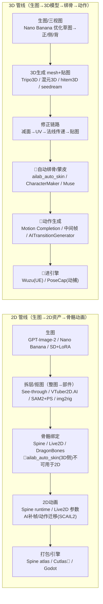

# 2D + 3D 双管线统一分析：生图 → 游戏可用资产（含网易内部缺口）

> 日期：2026-08-13 ｜ 依据：`生图.md`（网易 DreamMaker/KM 全链路）+ 外部工业化调研（2025-2026）
> 图例：🔴 = 网易内部产品（**我们无法使用 = 缺口**，标注其功能+实现方式）；✅ = 可用/开源/外部可替代

## 0. 双管线总览（一图流）

## 1. 2D 管线全链（生图→2D 资产→骨骼动画）
| 环节 | 网易内部（缺口） | 功能 + 实现方式 | 可用替代 |
|---|---|---|---|
| 生图 | 🔴 DreamMaker（生图平台，数千卡 GPU 混合云，最快 1s，单张~0.008 元） | 大规模生图底座 + 平台化批量/工作流 | ✅ 我们已用 GPT-Image-2 中转站（多图引用已验证）+ ComfyUI（本地） |
| 工作流编排 | 🔴 SunshineFlow（DreamMaker 上蓝图） | 多模型/节点串联成"蓝图"自动化，已集成 GPT-Image-1，批量+预览 | ✅ ComfyUI 工作流 / n8n / LangGraph（agent 编排） |
| 生图→PBR 贴图 | 🔴 Davincci（Tex2PBR，180s 端到端） | 基于 Ubisoft **CHORD**：单步扩散+LEGO-conditioning（CLIP 文本模态开关）→ BaseColor/Normal/Roughness/Metalness；后处理 Normal→Height（Poisson）/Height→AO（Ray Marching）/Real-ESRGAN 超分；输出 {name}_D.tga / _NRM.tga 直进引擎 | ✅ **CHORD 本身是 Ubisoft 开源**（SIGGRAPH Asia 2025，可自部署）；Substance/自研后处理 |
| 角色皮肤概念图（批量+人工飞轮） | 🔴 DreamMaker 项目专属 LoRA + 流水线（元素提取→JSON→prompt→gpt-image-2→归档→人工审核反哺标杆库） | 结构化 JSON 元素 + 校验（图文/逻辑一致）+ 风格标杆库锁渲染风格 + preferences/lessons 反馈库 | ✅ 我们已做：persona→prompt→多参考锁风格；可加"风格标杆库+反馈飞轮"（见 style_attempts） |
| 拆层/抠图 | （生图.md 未覆盖 2D 拆层 AI 化） | — | ✅ 外部成熟：See-through（2.5D 分层+深度）/ VTuber2D.AI / SAM2+PS / img2rig |
| 2D 骨骼绑定 | 🔴 网易无 AI 2D 绑骨（KM 检索结论：2D 动效编辑器手工为主） | 网易仅 SpineComponent 引擎支持；绑骨手工 | ✅ 外部 2025-2026 半自动：UniRig（ComfyUI）/ Spine-Anim-AI / StretchyStudio（DWPose）/ Spiritus（~30s 自动 rig） |
| 2D 动画 | （无 AI 自动方案） | Spine/Live2D 编辑器手工关键帧 | ✅ Spine runtime API / Live2D 参数；AI 补帧/动作迁移：SCAIL2 / 序列帧 2dimg2motion |
| 图集打包 | 🔴 Cutlas（UI 图集自动化） | 头像/技能卡/立绘/地图按规范自动打包（512/2048 图集） | ✅ TexturePacker / 自写脚本（PIL 打包） |

## 2. 3D 管线全链（生图→3D 模型→绑骨→动作→引擎）
| 环节 | 网易内部（缺口） | 功能 + 实现方式 | 可用替代 |
|---|---|---|---|
| 生图优化+三视图 | 🔴 DreamMaker/Nano Banana（草图→三维渲染图，多视图精度>单图） | 一致性关键：正/侧/背三视图 | ✅ 我们已验证多参考生图（images.edit 多图）；三视图=逐视图生成 |
| 3D 生成 | （平台内集成，非内部独有）Tripo3D / 混元3D / hitem3D / seedream / 影眸 | 多图→mesh+贴图（GLB/FBX/OBJ） | ✅ Tripo API（有试用 key）/ 混元3D 开源 / Meshy / TRELLIS |
| 修正链路 | （常规 DCC）减面→重构 UV→法线传递→贴图 | 生成模型面数多、UV 待改进 | ✅ Blender（减面/UV）+ 自研脚本 / DCC-MCP |
| 自动绑骨/蒙皮 | 🔴 ailab_auto_skin（自动骨骼+全身/部件蒙皮+平均权重+复制权重+骨骼清理，省 50-70% 时间） | 深度学习预测每顶点骨骼权重；自动骨骼=AI 检测人体结构生成骨架+蒙皮三步并一步；部件蒙皮=专门模型（裙摆/披风单链/双链） | ✅ Mixamo（免费网页，上传模型自动绑骨蒙皮+动作库）/ RigNet（开源，SIGGRAPH 2020）/ Blender Auto-Rig Pro / GoSkinning（付费） |
| 时装蒙皮 | 🔴 CharacterMaker（时装蒙皮、部件优化、自定义规范） | 更接近美术手绑的时装蒙皮 | ✅ Blender 手绑 / Auto-Rig Pro / Mixamo |
| 身体自动绑定 | 🔴 Muse（对标 Mixamo，在线化，关节定位+蒙皮） | 在线上传模型自动绑骨 | ✅ 直接用 Mixamo（免费替代品） |
| 动作补全 | 🔴 Motion Completion（AI 动画师，AAAI 2022 oral） | **BERT transformer** + 混合 embedding（位置编码+关键帧位移/旋转编码）+ 1D 卷积头 + Slerp 预填充 + 损失（重建/IK 动力学/滑步/小波）；能力：In-betweening / In-filling / Blending；CPU 30帧/0.025s；LaFAN1 最佳 | ✅ 开源动作补全/动作库（Mixamo 动作库 / Unity 骨骼动画手K / 论文复现） |
| 动作中间帧 | 🔴 动作中间帧生成（MotionBuilder 插件） | 起始+结束两帧 → 自动生成 20-60 帧动作，不依赖轨迹/中间帧 | ✅ Mixamo 动作 / 手K / AI 视频迁移（SCAIL2） |
| 引擎运行时动作 | 🔴 AITransitionGenerator（messiah 节点） | context_transformer 运行时神经网络实时生成过渡动作 | ✅ Godot AnimationTree / Unity Animator 过渡（传统方案） |
| 视频动捕 | 🔴 PoseCap（Muse 平台） | 上传动作视频→提取动作+相机→Bip/fbx 标准动画 | ✅ 开源：MediaPipe/OpenPose→BVH；80.lv 视频转动作插件；Rokoko/RADiCAL |
| 动作迁移 | ✅ ComfyUI SCAIL2（外部/开源） | 驱动视频+参考角色图→角色"跳"视频动作；SAM3 双 mask 跟踪；Base/Extend 分段生成 | ✅ 直接用（ComfyUI 工作流） |
| 进引擎（场景替换） | 🔴 Wuzu（UE5 插件，艺设三部 TA 中台） | WebSocket 双向桥（视口→RGB+深度+法线+Color-ID+场景描述）→画布 3D 生成→一键导入（格式嗅探+AI 命名+建目录+材质实例+打标）→三种替换入口（对话/原画/VLM 逐物体匹配/参数化） | ✅ Godot 手动/程序化导入；DCC-MCP（自研适配器控制 Blender） |
| 图集 | 🔴 Cutlas | 同 2D | ✅ TexturePacker / 自研 |

## 3. 统一结论
1. **2D 管线**：生图→拆层→骨骼→动画→引擎，**外部已全部有可用方案**（唯一缺口 = 网易内部平台 DreamMaker/SunshineFlow/Cutlas，均有等价替代）。
2. **3D 管线**：生图→3D 生成→修正有可用方案（Tripo/混元3D/Meshy + Blender）；**绑骨/蒙皮/动作/动捕 = 网易内部工具缺口集中区**，但有成熟替代：绑骨蒙皮用 **Mixamo/RigNet/Auto-Rig Pro**，动作用**动作库+手K+SCAIL2 迁移**，视频动捕用**开源 MediaPipe/OpenPose→BVH**。
3. **2D 骨骼动画是网易都没有的环节**（KM 检索无 2D AI 绑骨），反而是我们外部调研的**UniRig/Spine-Anim-AI/StretchyStudio** 提供了突破口 → 这是本项目相对网易内部能力的**差异化优势点**。
4. 网易内部工具的**实现方式**（CHORD 扩散分解、Motion Completion BERT-transformer+IK/滑步/小波损失、ailab_auto_skin 深度学习权重、Wuzu 双向桥+VLM 匹配、PoseCap 视频动捕）均可作为我们选型/自研的**技术参照**。

## 4. 下一步
1. 定主画风（style_attempts 三选一）→ ComfyUI + 风格 LoRA
2. 2D 线：拆层（See-through/VTuber2D.AI）→ 骨骼（Spine+UniRig/Spine-Anim-AI）→ Godot 导入
3. 3D 线（后置）：Tripo/混元3D + Blender 修正 + Mixamo 绑骨（如需要）
4. 用开放工具补齐所有🔴缺口（表内"可用替代"列）
